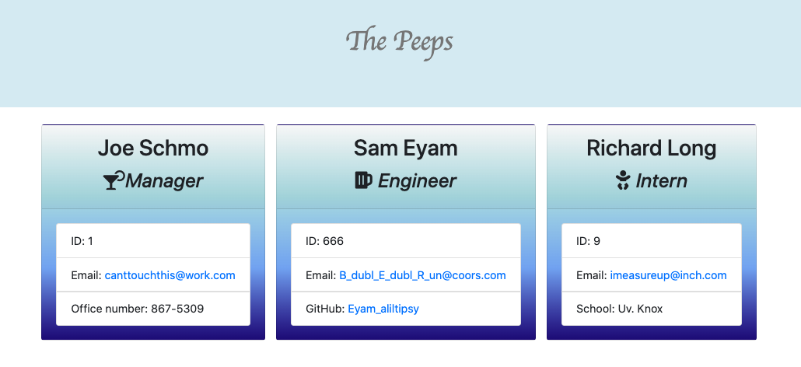
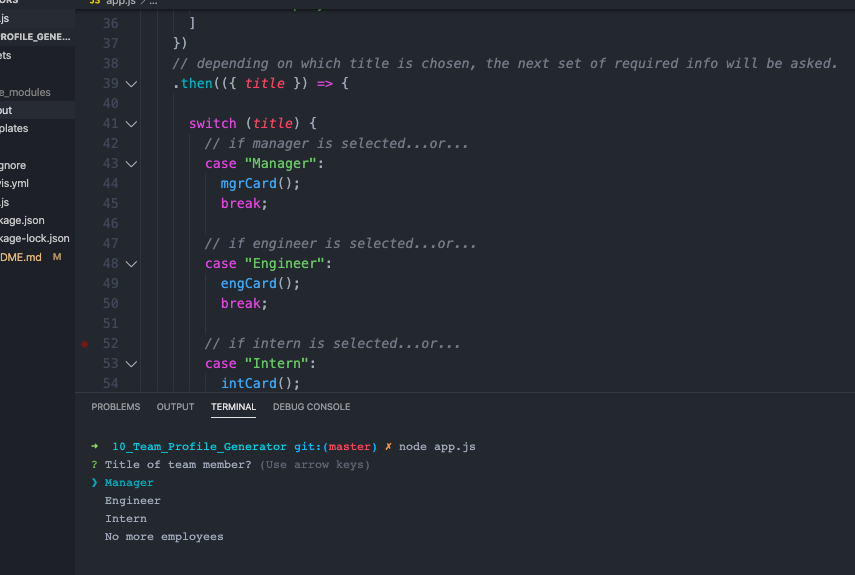
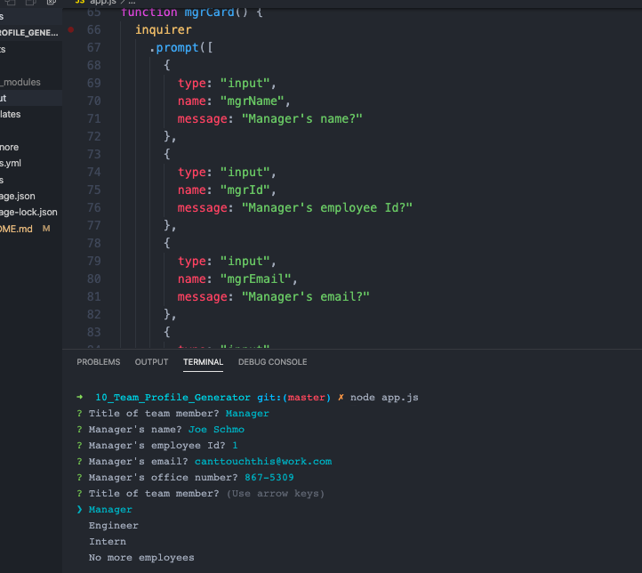

  # Project Name  
  Team Digital Rolodex

  ## Overview 
  A generator that promtps user to input contact information about team members then builds cards and outputs an html file with all the information.  It's a digital rolodex! 

  ## Table of Contents:
  - [Links](#Links)
  - [Screenshots_and_GIFs](#Screenshots_and_GIFs)
  - [Motivation](#Motivation)
  - [Installation](#Installation)
  - [How_to_use](#How_to_use)
  - [Benefit](#Benefit)
  - [License](#License)
  - [Tests](#Tests)
  - [Contribute](#Contribute)

 ## Links
  - (https://jmeggles.github.io/Team_Digital_Rolodex/)
  - (https://github.com/jmeggles/Team_Digital_Rolodex)

 ## Screenshots_and_GIFs 
  - 
  - 
  - 
  - 
  
  ## Motivation
  This project is to organize personal info and to access contact info quickly.  It is best used when new members are added to a team so all the info can be quickly accessed when needed. 

  ## Installation  
  Use npm inquirer package.

  ## How_to_use
  After installing npm pkg, from terminal, run node app.js to generate the prompts. Answer all prompts and after all cards are completed, an output folder will process an html file that can be viewed on a server with all the info in a card style framework.  

  ## Benefit
  Anyone!  This will benefit managers, team leaders, or anyone who needs to keep contact information on file. 

  ## License 
  MIT

  ## Credits
  John Dinsmore, Jorge Alvarez, Ben Benson WebDev Tutoring, W3 Schools (https://www.w3schools.com/js/), Mozilla (https://developer.mozilla.org/en-US/).

  ## Tests
 This project passed all 17 tests prior to building application. *See gif above* [Screenshots_and_GIFs](#Screenshots_and_GIFs)

  ## Contribute
  Yes. Commit or comment to the project in github.

  © Copyright 2020

